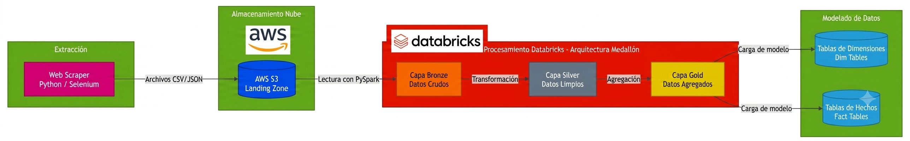
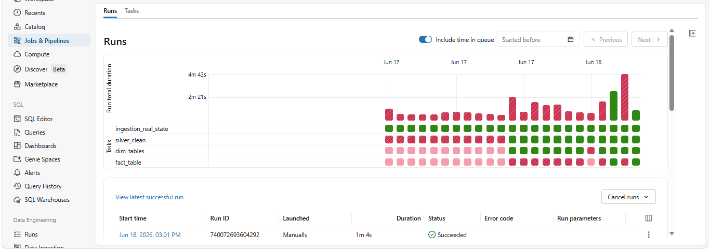

# 🏗️ Real Estate Data Pipeline

Este proyecto documenta desde la extraccion de datos con tecnicas de web escraping usando drission y selenium hasta modelo dimensional Dim_tables y Fact_tables para su explotacion analitica.

Inclui en este repositorio el  bundle, dos archivos csv, y el archivo con los codigos postales para hacer el cruce de datos. En resorces encotraras el archivo variables.yml donde se configura nombres de schema y catalog.

ruta de el archivo con los codigos postales:
/Volumes/real_state_project_bundle/raw_data/catalogo_maestro/CPdescarga.txt

ruta de los archivos csv:
/Volumes/real_state_project_bundle/raw_data/real_state_csv_landing_volume

En este caso se describe el proceso de etl que se llevo acabo en la plataforma Databricks.

La plataforma de almacenamiento  **aws**, el servicio **s3**.
Se creo una cuenta de administrador que se agrego a un grupo administradores ya que no es recomendable usar la cuenta root.

El catálogo principal (`real_estate_project`) fue configurado en **Unity Catalog** utilizando un bucket de **AWS S3** como *Storage Location*. Esto garantiza que los archivos físicos residan de forma segura en la nube de AWS, evitando el *vendor lock-in*, mientras Databricks gestiona la gobernanza, los permisos y el procesamiento.

Los archivos csv se guardan en un directorio llamado landing del buck real_estate_location_s3, en este mismo buck es donde se creo el catalog llamado real_estate_project.

En el schema raw_data_real_state se creo un volume donde se conecta con el directorio landing donde llegan los archivos csv.

En la capa bronze se agrego una columna rescue en caso de que llegue alguna columa nueva.

En la capa silver como la informacion extraida no esta bien estadarizada por los que suben la informacion al portal se necesito hacer un cruce con la informacion de los municipios y estados en un archivo descargado de correos de mexico, utilize la tecnica **Broadcast Hash Join** que es la opcion mas optima, ademas se hizo limpieza de datos con regex pyspark, ademas de darle el formato (Integer, Float, Timestamp) a las metricas nativas mediante type casting. La informacion se guardo de formato Delta.

Para la capa gold se crearon DimTable y FactTable. Para las DimTable se implemento Slowly Changing Dimension Type 1 mediante una carga incremental **High-Water Mark**,las llaves son Llaves Subrogadas Determinísticas **(Hashing MD5)**.Se implementó la librería concurrent.futures.**ThreadPoolExecutor** para lanzar múltiples hilos en paralelo, permitiendo que la creación de DimInmuebles y DimUbicaciones ocurra de manera estrictamente simultánea.

En FactTable las métricas de negocio sons: Precio, Area_m2, Recamaras, Estacionamientos, y Banos. Si en algún momento en el futuro agregas la automatización del esquema (como optimizar los archivos de la tabla de hechos con **OPTIMIZE** o **ZORDER** por fecha y ubicación en Databricks).

El pipeline se automatizo y orquesto atraves de **Databricks Workflows (Jobs & Pipelines)**, en la imagen se nota el proceso de fallas y correciones. Si estas practicando databricks siéntete completamente libre de hacer fork de este repositorio, explorar el código, replicar la Arquitectura Medallón o utilizar este pipeline como referencia.

